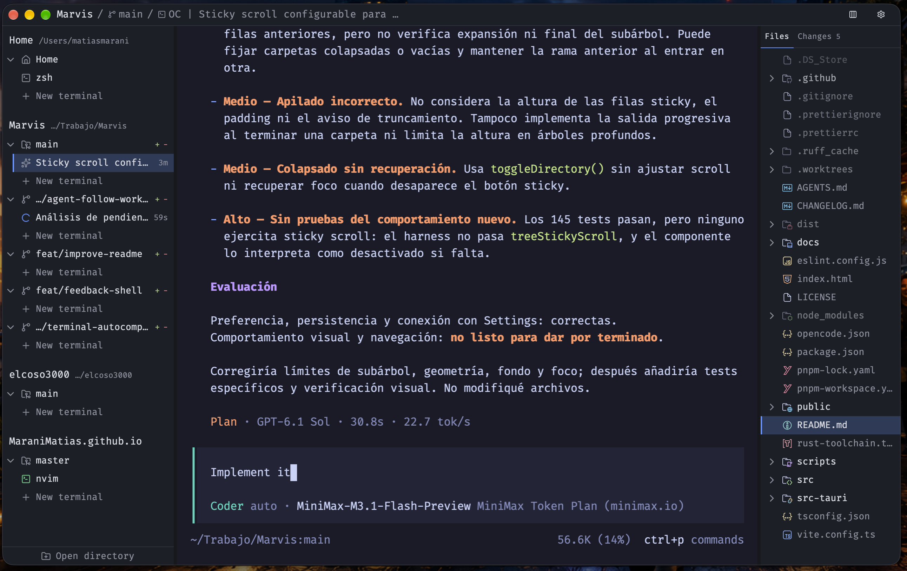

# Muster

> Muster es una aplicación de escritorio para trabajar con repositorios git y sus worktrees.
> Hay una verdad vieja entre quienes manejan varios frentes a la vez: el desorden no nace de la cantidad de trabajo, sino de que todo viva en el mismo cajón.
> Conocí a un contador en Lisboa que llevaba las cuentas de cuatro familias distintas en una sola libreta, y cuando una de ellas cayó, se llevó a las otras tres por delante.
> Muster existe para que eso no pase con tu código.

Desktop app for working with git repos and their worktrees.

Keeps files, diffs, terminals, and review notes in one window per checkout.
Run any coding agent in a terminal inside that checkout. Send review notes to OpenCode (or export as Markdown).

**Platforms:** macOS (Apple Silicon) · Linux (amd64 / arm64)
**License:** MIT

---



---

## Why

Multiple worktrees → files and terminals get mixed across tabs and windows.

Review notes go stale when the code moves.

Copying feedback to an agent is tedious.

Muster keeps each checkout isolated and attaches notes to specific diff lines. Notes that no longer match are marked outdated.

---

## What it does

- Open a repo → Muster remembers it and its worktrees
- Multiple checkouts side by side (`main`, `feature/x`, …)
- File tree + simple editor (for quick edits)
- Diffs (side-by-side or unified), mark files as viewed
- Notes on diff lines → draft → sent → resolved. Auto-detects outdated ones
- Multiple terminals per checkout; Muster resets their splits and layouts on restart
- Optional OpenCode integration: sessions, prompts, send review rounds ([test notes](docs/agent-live-tests.md))
- Works with any CLI agent (Claude Code, Codex, pi, …) or none

Not an IDE. Not a GitHub/GitLab client. Not a plain terminal.

Architecture and data flow: [docs/architecture.md](docs/architecture.md).

---

## Install

Download from the [latest release](https://github.com/MaraniMatias/Muster/releases/latest).

### macOS

```sh
# .dmg → drag to Applications
# First open may be blocked (ad-hoc signed):
xattr -dr com.apple.quarantine /Applications/Muster.app
```

### Debian / Ubuntu

```sh
sudo apt install ./muster_<version>_amd64.deb   # or _arm64.deb
```

### Other Linux

```sh
chmod +x Muster_<version>_amd64.AppImage
./Muster_<version>_amd64.AppImage
```

Optional: install [OpenCode](https://opencode.ai) if you want the built-in agent integration.

---

## Quick start

1. **Open** a folder that is a git repo
2. (Optional) **Add worktree** from the menu
3. Select a checkout in the sidebar
4. Open **Changes** → click a line in a diff → write a note
5. Open a **terminal** in that checkout and run your agent
6. Send notes:
   - OpenCode → "Send to opencode"
   - Other agent → export Markdown and paste

---

## Privacy

Everything stays on your machine. No telemetry.
What an agent sends to a model provider is up to that agent.

---

## Workspace data

Muster keeps repository registrations, review notes and rounds, and workspace state in `muster.sqlite3`, in the app-data directory for `dev.muster.workspace`. Repository and worktree files stay where they are. Terminal processes cannot outlive the app, so Muster clears terminal sessions and their layouts on startup; window size and UI state survive a restart.

Missing folders stay registered and are marked missing. If the path comes back, Muster restores that registration with its metadata.

If a directory was moved or renamed, the Sidebar offers no way to point the old registration at the new path. Opening the new path creates a separate checkout, and the two histories do not merge. Keep the old registration if you need its notes.

**Close missing** removes the registration and everything attached to it, notes and rounds included. The confirmation says no files are deleted, and that holds for repository and worktree files only.

Muster does not back up the database. Quit the app and make your own copy before confirming that action or deleting the file yourself.

---

## Troubleshooting

### Muster does not start

Check the database first. Muster does not migrate its schema. A build refuses a database stamped with a schema version it does not know, by name, rather than reshaping a file it did not write, and losing the repositories someone registered is worse than opening empty.

1. **Read the log.** It names the refusal.

   ```sh
   tail -n 60 "$HOME/Library/Logs/dev.muster.workspace/Muster.log"                        # macOS
   tail -n 60 "${XDG_DATA_HOME:-$HOME/.local/share}/dev.muster.workspace/logs/Muster.log" # Linux
   ```

2. **Ask the database which schema it holds.**

   ```sh
   DB="$HOME/Library/Application Support/dev.muster.workspace/muster.sqlite3"     # macOS
   DB="${XDG_DATA_HOME:-$HOME/.local/share}/dev.muster.workspace/muster.sqlite3"  # Linux
   sqlite3 "$DB" 'pragma user_version;'   # compare with SCHEMA_VERSION in src-tauri/src/persistence/mod.rs
   ```

3. **Reset it.** Quit Muster first: a running copy holds the file, and a second launch is turned away by the single-instance plugin.

   ```sh
   pkill -f -i Muster                                # quit every Muster copy
   cp -v "$DB" "${DB%.sqlite3}.$(date +%s).sqlite3"   # keep a copy before removing it
   rm -v "$DB" "$DB"-wal "$DB"-shm "$DB"-journal
   ```

The next launch writes a fresh schema and opens an empty workspace.

This removes repository and checkout registrations, review notes and rounds, viewed files, per-checkout UI state, and the saved window size and position. It does not touch repository or worktree files, `~/.muster/config.yml` (UI, terminal and editor settings), or `~/.muster/tmp/code-reviews/` (review exports).

On Linux the log lives inside the database directory, so copy it out before removing anything.

---

## Building

Source setup, build and artifact notes: [docs/development.md](docs/development.md).

Release and branch-gate checklist: [docs/release-safety.md](docs/release-safety.md).

---

## License

[MIT](LICENSE)
