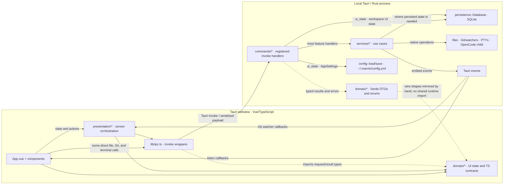
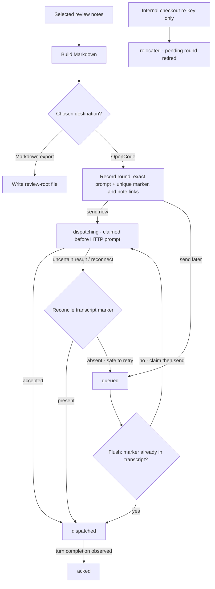

# Architecture

This describes the current implementation, not a target design. Marvis is a local Tauri desktop app: the Vue webview talks to one Rust process, which owns the database and native processes. There is no Marvis cloud service or remote database.

## Runtime boundary

Solid arrows are runtime calls/events; dotted arrows are type/serialization relationships, not calls. These are logical areas, not a strict one-way frontend rule: some components call `lib/ipc.ts` directly. TypeScript contracts in `src/domain` and Rust Serde types in `src-tauri/src/domain` are maintained separately. Tauri commands are a desktop IPC surface, not a public HTTP API; command results are typed values and errors use `{ code, message }` via [`IpcError`](../src-tauri/src/domain/ipc.rs). Inputs are checked at the command/service boundary for checkout, agent-session, terminal-session, and path ownership.

The entrypoint registers the handlers and owns the app-scoped `Database`, Git watcher manager, PTY backend, and `AgentService` in [`main`](../src-tauri/src/main.rs). The frontend entry/orchestration is [`App.vue`](../src/App.vue); workspace orchestration is [`useWorkspaceState`](../src/presentation/workspace.ts); Tauri `invoke` wrappers are in [`src/lib/ipc.ts`](../src/lib/ipc.ts). Most feature handlers call use cases in [`services`](../src-tauri/src/services), but that route is not universal: [`commands/ui_state.rs`](../src-tauri/src/commands/ui_state.rs) accesses `Database` directly for workspace UI state and calls `config::load/save` directly for general [`AppSettings`](../src-tauri/src/config.rs). The backend workspace service delegates selected worktree operations to the worktree service; the production dependency is one-way (`workspace` → `worktree`), not a callback in reverse: [`services/workspace.rs`](../src-tauri/src/services/workspace.rs), [`services/worktree.rs`](../src-tauri/src/services/worktree.rs).

## Workspace and persistence

A workspace contains registered repositories; a Git repository contains a primary checkout and its worktrees. Checkout identity is path-based. [`register_folder`](../src-tauri/src/services/workspace.rs) resolves a selected directory into that model; [`create`](../src-tauri/src/services/worktree.rs) and [`remove`](../src-tauri/src/services/worktree.rs) perform the actual Git worktree operations. Missing directories remain registered and are marked missing; when the same path returns, reconciliation restores that identity. The frontend has no moved-checkout relocation action; opening a moved directory creates a separate identity. The backend's internal `locate_missing_checkout` path is not a user workflow (see [workspace recovery](development.md#workspace-data-and-recovery)).

[`Database`](../src-tauri/src/persistence/mod.rs) stores registrations, review notes/rounds, and workspace-specific UI state/preferences in `marvis.sqlite3`; repository files stay in their checkout directories. General `AppSettings` (UI, terminal, and editor choices) are YAML in `~/.marvis/config.yml`, not SQLite settings ([`config_file`](../src-tauri/src/config.rs), TypeScript shape in [`src/domain/settings.ts`](../src/domain/settings.ts)). The current schema is **13**. A nonzero database stamped with another schema is refused; pre-1.0 builds do not migrate it. Full workspace loads use four set queries (three for a checkout-scoped load), then group rows in memory rather than issuing per-checkout queries. Archived checkouts remain registered and on disk, but are excluded from the active workspace and checkout-path lookup. Archive/restore preserves their metadata; `is_archived` is included in registration snapshots used for compare-and-set checks. Archive also reserves affected agent checkouts and stops their idle OpenCode bridges after the database change. The in-memory agent generation/epoch is separate from the persisted archive flag: it invalidates stale work after a checkout lifecycle change.

PTY processes are app-owned and cannot survive app exit. Startup clears their stored sessions/layouts; persisted window and UI state remain. See [workspace data and recovery](development.md#workspace-data-and-recovery) for schema refusal, missing paths, archiving, and backup behavior.

## Review data paths

The user chooses notes in the webview. [`sendReviewToAgent`](../src/App.vue) builds Markdown once. Export calls [`export_review_markdown`](../src-tauri/src/services/files.rs), which writes a Markdown file under the configured review root and opens it in the app; it does not create an agent round or send a prompt. OpenCode delivery uses a selected/new session scoped to the active checkout.

Recording a round transactionally stores its selected note IDs and exact prompt/marker and marks those notes `sent` before delivery. [`queue_round`](../src-tauri/src/services/review_round.rs) leaves the agent alone; [`flush_rounds`](../src-tauri/src/services/review_round.rs) sends queued prompts oldest-first. `dispatching` is retained on ambiguous transport failure: [`reconcile_round`](../src-tauri/src/services/review_round.rs) checks the marker in the session transcript to decide `dispatched` versus safe requeue, avoiding blind duplicate sends. The frontend acknowledges a dispatched round after observing turn completion; `relocated` is used only when the internal checkout re-key retires pending rounds, not by a Sidebar action. The state handling is in [`useReviewNotes`](../src/presentation/review-notes.ts); persistence and conditional status changes are in [`persistence/mod.rs`](../src-tauri/src/persistence/mod.rs).

## Local processes, events, and concurrency

`AgentService` owns one `opencode serve` child per checkout, started with that checkout as its working directory. It binds to `127.0.0.1`, reads per-child credentials from the child, and authenticates its local HTTP requests with Basic auth. Its `/api/event` stream is SSE. Headers and event frames are size-bounded; the reader reconnects with capped backoff, and shutdown signals stop, closes the event socket, terminates the child, and joins readers under a deadline. Session IDs and returned directory scopes are checked against the requested checkout; foreign sessions/directories fail closed. See [`AgentBridge`](../src-tauri/src/services/agent.rs).

Agent requests snapshot a per-checkout generation and revalidate both that generation and current DB registration under the per-checkout operation lock. Each bridge event sink carries that checkout's generation and drops events after its lifecycle epoch changes. Multi-checkout operations sort/deduplicate IDs before locking and reserving them, validate registration snapshots, and commit generation changes only after success. Global bridge/map locks are released before child startup and stop/join work; a per-checkout operation lock can remain held across the HTTP call, so agent I/O is not wholly lock-free. Worktree/archive/close operations refuse active agent turns and stop idle bridges only after success ([`AgentService`](../src-tauri/src/services/agent.rs), [`with_agent_checkout_guards`](../src-tauri/src/services/workspace.rs)).

Git watching is one watcher per repository, covering live worktree roots and their Git directories plus the shared Git directory. The webview sends the expected live checkout IDs and a fresh registration ID; Rust validates the requested plan. Failure events echo that identity, and the frontend ignores stale failures from an earlier registration. See [`useGitWatchers`](../src/presentation/git-watchers.ts), [`git_watch_repo`](../src-tauri/src/commands/git.rs), and [`GitWatcherManager`](../src-tauri/src/services/git.rs).

The terminal subsystem owns PTYs through [`TerminalBackend`](../src-tauri/src/terminal/mod.rs). Files, Git, review export, worktree operations, and agent integration are local native-side services; other CLI agents are run by the user inside those checkout terminals and are not managed through OpenCode's API.

## Build and audit boundary

`pnpm build` type-checks/builds the frontend and generates third-party notices. The production [`build:app` wrapper](../scripts/build-app.mjs) validates `rustc` and Cargo from Rust **1.97.1** and invokes Tauri/Cargo with `--locked`; an arbitrary installed CLI/Cargo toolchain is not a substitute for that production path. Notice generation reads installed production JavaScript metadata and Cargo's resolved normal dependency graph. Exact-revision license sidecars are hash-checked and are not fetched during builds. The current inventory reports **30 packages without installed license text**; notices flag this gap and do not cover dynamically linked Linux GTK/WebKit/system libraries or unverified font glyph-patch licensing ([generator](../scripts/build-third-party-notices.mjs)).

The Rust dependency audit queries OSV and fails closed on unknown or moderate-and-higher findings or if it cannot verify results. GTK 0.18 still requires `glib 0.18`, so Marvis vendors 0.18.5 with only the upstream `gtk-rs/gtk-rs-core#1343` soundness fix backported. The audit reports `RUSTSEC-2024-0429` as fixed only when Cargo resolves that exact local package and its entire source tree matches the pinned SHA-256; every other advisory remains subject to the normal blocking policy ([backport provenance](glib-backport.md), [audit](../scripts/audit-rust.mjs), [CI workflow](../.github/workflows/ci.yml)).
